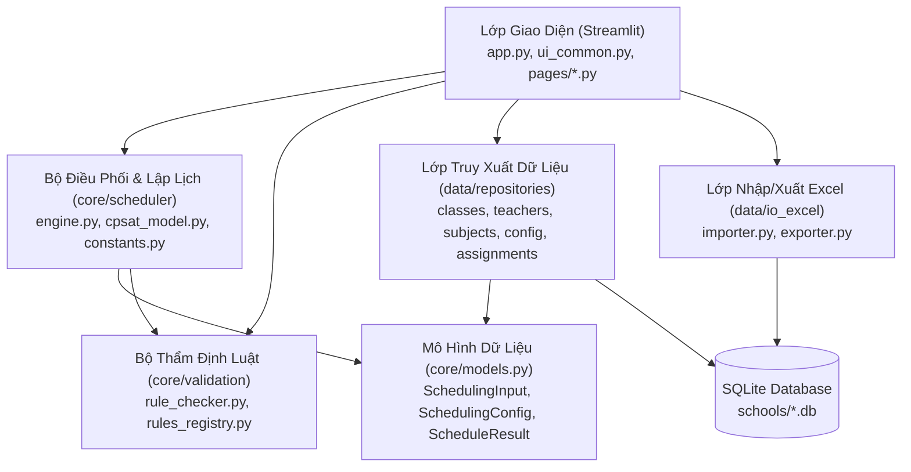
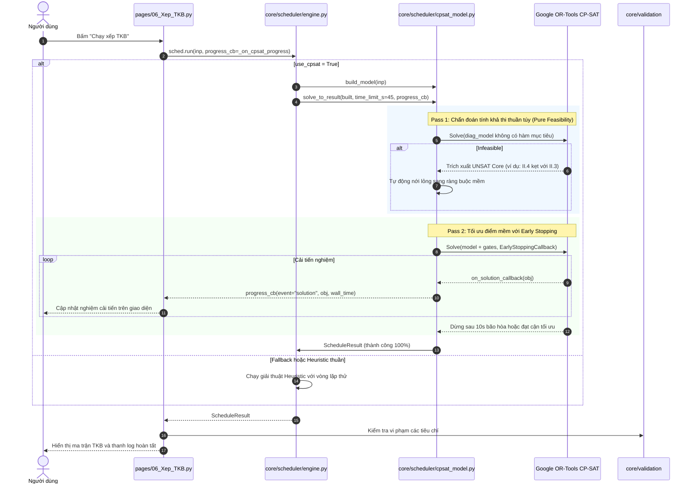

# TKB App — Kiến Trúc Hệ Thống & Bản Đồ Thành Phần (GitNexus Map)

> Được lập chỉ mục và phân tích bởi **GitNexus Knowledge Graph**: 101 tệp, 1,254 symbols, 2,724 quan hệ, 57 cụm chức năng (communities), 53 luồng thực thi (processes).

---

## 1. Tổng Quan Kiến Trúc (Architecture Overview)

Hệ thống được tổ chức theo kiến trúc phân tầng rõ ràng (Layered Architecture):

---

## 2. Các Cụm Chức Năng Chính (Functional Clusters)

Dựa trên thuật toán phân cụm Leiden từ Knowledge Graph của GitNexus:

| Cụm (Community) | Tệp chính | Vai trò & Trách nhiệm |
|---|---|---|
| **Scheduler** | `core/scheduler/engine.py` `core/scheduler/cpsat_model.py` `core/scheduler/constants.py` `core/scheduler/quality.py` | Lõi xếp TKB toàn trường. Bao gồm: bộ giải toàn cục Google OR-Tools CP-SAT (Pass 1: chẩn đoán khả thi thuần túy; Pass 2: tối ưu đa mục tiêu với Early Stopping) và bộ giải Heuristic ngẫu nhiên dự phòng. |
| **Validation** | `core/validation/*.py` `core/rules_registry.py` | Kiểm tra vi phạm 18 tiêu chí (I.1 - II.15) đối với kết quả xếp TKB hoặc dữ liệu nhập vào. |
| **Repositories** | `data/repositories/*.py` `data/db.py` | Tương tác SQLite CRUD với các bảng phân công, giáo viên, lớp học, cấu hình tuần/tiết/phòng. |
| **Io_excel** | `data/io_excel/importer.py` `data/io_excel/exporter.py` | Đọc/ghi biểu mẫu Excel chuẩn của Bộ GD&ĐT, giữ nguyên định dạng viền, màu sắc, phông chữ. |
| **UI Pages** | `app.py`, `pages/*.py` `ui_common.py` | Giao diện tương tác Streamlit: Khai báo, Phân công, Xếp TKB (06_Xep_TKB.py), Xem & Chỉnh sửa, Xuất bản. |
| **Tests** | `tests/test_*.py` | 40+ unit & integration test đảm bảo độ chính xác của các ràng buộc toán học và bộ chẩn đoán. |

---

## 3. Luồng Thực Thi Chính: Xếp Thời Khóa Biểu (Execution Flow)

---

## 4. Ràng Buộc Khóa & Cơ Chế Xử Lý Ngoại Lệ (Key Constraints)

1. **Quy luật Tránh Tiết Lẻ (II.4) & Tránh Kẹp Sáng-Chiều (II.8)**:
   - Giáo viên thông thường: Cấm cứng 1 tiết/buổi hoặc sáng 1 tiết + chiều 1 tiết.
   - Giáo viên được miễn trừ (như cô Hòa - kiêm nhiệm thiết bị/thư viện):
     - Được phép dạy tiết lẻ nhưng **TỐI ĐA 1 đến 2 buổi/tuần** (`sum(t_lones) <= 2`).
     - Nghiêm cấm dạy kẹp 1 sáng + 1 chiều trong cùng ngày (phạt mềm cực đại $520$ điểm).
2. **Quy luật Sáng Bắt Buộc (II.3)**:
   - Toàn bộ giáo viên có tải $\ge 10$ tiết phải có mặt và có giờ dạy vào sáng Thứ 2, Thứ 5, Thứ 6.
   - Khi năng lực phòng/lớp sáng Thứ 2 nhỏ hơn tổng số giáo viên $\times 2$ tiết, Pass 1 tự động xác định xung đột toán học và chuyển II.4 thành phạt mềm có kiểm soát.
