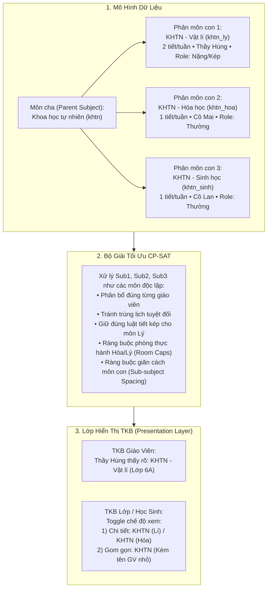

# Đặc Tả Thiết Kế Hệ Thống: Phân Môn Đa Giáo Viên & Nghiệp Vụ Điều Hành Dạy Thay (Timetable Scheduling & Operations)

> **Mã định danh:** `SPEC-2026-09-17-PHANMON-DAYTHAY`  
> **Dự án áp dụng:** `tkb_app` (Phần mềm Xếp & Điều Hành Thời Khóa Biểu Trường Học)  
> **Phiên bản kiến trúc:** v3.1 (Tập trung toàn diện vào Bài toán Thời Khóa Biểu)  
> **Tác giả:** Antigravity AI & Ban Phát Triển TKB  
> **Trạng thái:** Đặc tả kỹ thuật chi tiết hoàn chỉnh (Full Technical Specification)  

---

## 1. Bối Cảnh & Đặt Vấn Đề (Context & Motivation)

### 1.1. Hiện trạng kiến trúc xếp lịch trong `tkb_app`
Trong phiên bản hiện tại, hệ thống `tkb_app` sử dụng mô hình ánh xạ 1-1 cho bảng phân công chuyên môn:
$$\text{assigned\_teacher}: (subject\_id, class\_id) \rightarrow teacher\_id$$
Biến quyết định trong bộ giải tối ưu CP-SAT (`core/scheduler/cpsat_model.py`) là:
$$x[slot\_id, subject\_id] \in \{0, 1\}$$
Trong đó, giáo viên giảng dạy tại mỗi slot được suy ra tiền định:
$$teacher\_of[slot\_id, subject\_id] = assigned\_teacher[subject\_id, class\_id]$$

### 1.2. Hai "điểm nghẽn" lớn trong bài toán Thời Khóa Biểu

1. **Điểm nghẽn 1: Một môn của một lớp có nhiều giáo viên khác nhau dạy**
   - **Chương trình GDPT 2018 (Cấp THCS & THPT)** sinh ra các môn tích hợp liên môn:
     - **Khoa học tự nhiên (KHTN)**: 4 tiết/tuần gồm 3 phân môn *Vật lí* (2 tiết), *Hóa học* (1 tiết), *Sinh học* (1 tiết). Đại đa số trường học phân công 2 đến 3 giáo viên khác nhau dạy 3 phân môn này.
     - **Lịch sử & Địa lí**: 3 tiết/tuần do GV Lịch sử và GV Địa lí chia nhau đảm nhiệm (thường phân 1.5 tiết/kỳ hoặc chẵn lẻ 2-1).
     - **Nghệ thuật**: 2 tiết/tuần gồm *Âm nhạc* (1 tiết) và *Mĩ thuật* (1 tiết) do 2 GV chuyên biệt dạy.
     - **Hoạt động trải nghiệm, hướng nghiệp (HĐTN, HN)**: 3 tiết/tuần chia cho Tổng phụ trách (Chào cờ), GV phụ trách chuyên đề, và GVCN (Sinh hoạt lớp).
     - **Nội dung Giáo dục địa phương (GDĐP)**: Chia thành các mô-đun Văn, Sử, Địa, Âm nhạc... giao cho từng giáo viên bộ môn.
   - **Môn ngoại ngữ / Tăng cường / Tin học**: GV Việt Nam (3 tiết) + GV Bản ngữ/Liên kết (1 tiết); Tiết Lý thuyết trên lớp + Tiết Thực hành phòng máy.
   - **Hệ quả nếu giữ mô hình cũ**:
     - *Sai lệch định mức giảng dạy (`DinhMuc_GV`)*: 1 GV bị gánh toàn bộ số tiết, các GV còn lại bị tính thiếu tải.
     - *Xung đột lịch ảo và trùng tiết thật*: Hệ thống không thể biết tiết nào do ai dạy. Nếu Thầy A bận, hệ thống cấm cả môn; ngược lại Thầy A đang dạy lớp khác nhưng hệ thống vẫn xếp phân môn của Thầy A vào lớp này $\rightarrow$ Thầy A bị trùng tiết (bị "phân thân").
     - *Mất kiểm soát ràng buộc sư phạm*: Phân môn Lý cần xếp tiết kép (2 tiết liền), Hóa/Sinh cần tiết đơn. Solver không thể làm được nếu coi KHTN là một môn đồng nhất.
     - *Tranh chấp phòng thực hành/thí nghiệm*: Không kiểm soát được số lớp cùng học thực hành Lý, Hóa, Tin tại cùng một thời điểm.

2. **Điểm nghẽn 2: Nghiệp vụ Dạy Thay & Điều Hành Ma Trận TKB (Substitute Teaching & Swapping)**
   - Trường học là thực thể vận hành động: Giáo viên ốm đau đột xuất, nghỉ việc riêng, đi tập huấn/công tác, coi thi, nghỉ thai sản 6 tháng...
   - **Quy tắc vàng trong vận hành**: **TUYỆT ĐỐI KHÔNG CHẠY LẠI THỜI KHÓA BIỂU TOÀN TRƯỜNG** khi có giáo viên nghỉ đột xuất vài ngày. Nếu xếp lại toàn trường, lịch của 30-50 lớp và hàng trăm học sinh, giáo viên khác sẽ bị xáo trộn toàn bộ.
   - **Yêu cầu thực tế trên phần mềm TKB**:
     - Cần công cụ tương tác trực tiếp trên Ma trận TKB: Click để tìm người dạy thay hợp lệ tức thời hoặc đổi chéo tiết (Swap) an toàn 100%.
     - Kiểm tra xung đột tức thời: Người dạy thay có rảnh tiết đó không? Có bị vượt trần 5 tiết/ngày không? Có bị tạo tiết trống/lủng không?
     - Xử lý biến động dài hạn (nghỉ thai sản, điều chuyển phân công) thông qua cơ chế **Xếp lại cục bộ với Ghim ô (Targeted Pinning & Partial Rescheduling)**.
     - So sánh đối chiếu biến động giữa các phiên bản TKB (Timetable Delta / Diff Viewer).

---

## 2. Kiến Trúc Phân Môn & Đa Giáo Viên (Sub-subjects & Constraints)

### 2.1. Triết lý thiết kế cốt lõi
> **"Phân môn độc lập ở tầng CSDL & CP-SAT Engine — Gom nhóm hợp nhất ở tầng Hiển thị & Báo cáo"**

Thay vì sửa đổi cấu trúc biến quyết định của CP-SAT thành $x[slot, subject, teacher]$ (làm bùng nổ không gian tìm kiếm và làm chậm solver gấp 5 lần), ta xem **mỗi phân môn là một môn học con độc lập (Sub-subject)** trong quá trình xếp lịch.



### 2.2. Chi tiết CSDL (Database Schema Changes)

Bổ sung cấu trúc quan hệ cha - con và công suất phòng chuyên dụng vào CSDL SQLite:

```sql
-- 1. Nâng cấp bảng subjects (Migration an toàn)
ALTER TABLE subjects ADD COLUMN parent_subject_id INTEGER REFERENCES subjects(subject_id) DEFAULT NULL;
ALTER TABLE subjects ADD COLUMN sub_code TEXT DEFAULT NULL; -- 'ly', 'hoa', 'sinh', 'su', 'dia', 'nhac', 'my_thuat'
ALTER TABLE subjects ADD COLUMN is_composite BOOLEAN DEFAULT 0; -- 1 = Môn mẹ tích hợp
ALTER TABLE subjects ADD COLUMN required_room_type TEXT DEFAULT NULL; -- 'lab_ly', 'lab_hoa', 'lab_sinh', 'lab_tin', 'gym'
ALTER TABLE subjects ADD COLUMN max_concurrent_classes INTEGER DEFAULT 0; -- 0 = Không giới hạn; > 0 = Trần số lớp học cùng lúc (công suất phòng)

-- Chỉ mục tối ưu truy vấn phân môn
CREATE INDEX IF NOT EXISTS idx_subjects_parent ON subjects(parent_subject_id);

-- 2. Bảng quản lý phòng chức năng / sân bãi dùng chung
CREATE TABLE IF NOT EXISTS specialized_rooms (
    room_id INTEGER PRIMARY KEY AUTOINCREMENT,
    room_code TEXT UNIQUE NOT NULL,      -- 'LAB_HOA_01', 'LAB_TIN_01', 'NHA_DA_NANG'
    room_name TEXT NOT NULL,             -- 'Phòng Thí Nghiệm Hóa', 'Phòng Máy 1'
    room_type TEXT NOT NULL,             -- 'lab_hoa', 'lab_tin', 'gym'
    capacity_classes INTEGER DEFAULT 1,  -- Số lớp tối đa phục vụ đồng thời
    notes TEXT
);
```

### 2.3. Các ràng buộc toán học mới trong CP-SAT (`core/scheduler/cpsat/`)

#### A. Ràng buộc Công suất Phòng chức năng / Sân bãi (Specialized Room Capacity)
Khi phân môn hoặc môn học yêu cầu phòng chức năng đặc thù (trường chỉ có 1 phòng Hóa, 2 phòng máy vi tính):
$$\forall ts \in \text{TimeSlots}: \sum_{c \in \text{Classes}} x[slot(c, ts), subject\_id] \le \text{max\_concurrent\_classes}[subject\_id]$$
Bộ giải CP-SAT tự động dàn trải các lớp học thực hành sang các buổi khác nhau, loại bỏ hoàn toàn tình trạng tranh chấp phòng bộ môn.

#### B. Ràng buộc Giãn cách Sư phạm giữa các phân môn (Inter-sub-subject Spacing)
Để tránh việc dồn ép học sinh (ví dụ: Thứ 2 học Lý, Thứ 3 học Hóa, Thứ 4 học Sinh rồi cuối tuần trống trơn):
1. **Luật chống dồn trong buổi**: Tối đa 2 tiết của các phân môn thuộc cùng một môn mẹ trong 1 buổi của 1 lớp:
   $$\forall c, \forall (weekday, session): \sum_{s \in \text{Sub}(Parent)} \sum_{p=1}^5 x[slot(c, weekday, session, p), s] \le 2$$
2. **Luật giãn cách ngày (Soft Objective)**: Khuyến khích các phân môn khác nhau của môn mẹ được xếp cách nhau ít nhất 1 ngày trống:
   $$\text{Penalty} = 80 \times \sum_{c, Parent} \mathbb{I}(\text{Sub}_1 \text{ ngày } d \text{ và } \text{Sub}_2 \text{ ngày } d+1)$$

#### C. Hỗ trợ Tiết chia nhóm song song trong cùng 1 lớp (Parallel Split-Class Slots)
- Áp dụng cho môn Giáo dục thể chất (chia nhóm Nam/Nữ), Ngoại ngữ (chia nhóm trình độ), hoặc Tin học (chia phòng máy).
- Khi 1 slot của lớp $C$ được cấu hình chia nhóm:
  - Cả Giáo viên $T_1$ (dạy nhóm 1) và Giáo viên $T_2$ (dạy nhóm 2) đều có ràng buộc bận tại timeslot đó.
  - Cả 2 giáo viên đều được cộng 1 tiết vào định mức tuần của mình.

#### D. Hỗ trợ Giảng dạy Cuốn chiếu theo Tuần (Modular / Pacing Curriculum)
- `tkb_app` tận dụng bảng `weekly_curriculum (subject_id, class_id, week_no, periods)`:
  - Cho phép cấu hình: Tuần 1-12 chỉ học `khtn_ly` (4 tiết/tuần), Tuần 13-24 chỉ học `khtn_hoa` (4 tiết/tuần), Tuần 25-35 chỉ học `khtn_sinh` (4 tiết/tuần).
  - CP-SAT giải TKB theo từng giai đoạn hoặc giải mô hình tổng quát đảm bảo không vi phạm bất biến tại bất kỳ tuần nào.

---

## 3. Kiến Trúc Nghiệp Vụ Điều Hành Dạy Thay & Đổi Tiết (Timetable Operations)

### 3.1. Phân loại 3 cấp độ biến động TKB

```
                                  ┌────────────────────────────────┐
                                  │   HỆ THỐNG ĐIỀU HÀNH DẠY THAY  │
                                  └───────────────┬────────────────┘
                                                  │
         ┌────────────────────────────────────────┼────────────────────────────────────────┐
         ▼                                        ▼                                        ▼
┌───────────────────────────────┐┌───────────────────────────────┐┌───────────────────────────────┐
│ CẤP ĐỘ 1: ĐỔI CHÉO TIẾT       ││ CẤP ĐỘ 2: DẠY THẾ NGẮN HẠN    ││ CẤP ĐỘ 3: THAY ĐỔI DÀI HẠN   │
│ (Timetable Slot Swap)         ││ (In-place Short Cover)        ││ (Targeted Partial Re-solve)   │
├───────────────────────────────┤├───────────────────────────────┤├───────────────────────────────┤
│ • Hoán đổi vị trí 2 ô TKB     ││ • Giữ nguyên vị trí ô TKB     ││ • Thai sản 6 tháng, đổi GV    │
│ • Kiểm tra 2 bên không trùng  ││ • Gán tạm teacher_id cho tuần ││ • Ghim 95% TKB toàn trường   │
│ • Kiểm tra trần tiết & luật   ││ • Smart Match lọc GV rảnh     ││ • CP-SAT giải cục bộ 2-4s     │
│ • Tự động Highlight ô hợp lệ  ││ • Phản hồi tức thời < 50ms    ││ • Tối thiểu hóa xê dịch ô     │
└───────────────────────────────┘└───────────────────────────────┘└───────────────────────────────┘
```

### 3.2. CSDL Quản lý Ghi Nhận Dạy Thay & Lịch Sử Biến Động

```sql
CREATE TABLE IF NOT EXISTS substitutions (
    sub_id INTEGER PRIMARY KEY AUTOINCREMENT,
    week_no INTEGER NOT NULL,               -- Tuần áp dụng (1..35)
    weekday INTEGER NOT NULL,              -- Thứ (2..7)
    session TEXT NOT NULL,                 -- 'S' hoặc 'C'
    period INTEGER NOT NULL,               -- Tiết (1..5)
    class_id INTEGER NOT NULL,             -- Lớp học
    subject_id INTEGER NOT NULL,           -- Môn học
    original_teacher_id INTEGER NOT NULL,  -- Giáo viên chính khóa theo TKB
    substitute_teacher_id INTEGER,         -- Giáo viên dạy thay (NULL nếu hủy tiết)
    sub_type TEXT NOT NULL,                -- 'cover' (dạy thay), 'swap' (đổi tiết), 'cancel' (nghỉ)
    
    -- Đối tượng hoán đổi nếu là 'swap'
    swap_target_week_no INTEGER,
    swap_target_weekday INTEGER,
    swap_target_session TEXT,
    swap_target_period INTEGER,
    swap_target_class_id INTEGER,
    swap_target_subject_id INTEGER,
    swap_target_teacher_id INTEGER,
    
    reason TEXT,                           -- 'Ốm đau', 'Công tác', 'Việc riêng', 'Thai sản', 'Khác'
    notes TEXT,
    created_at TIMESTAMP DEFAULT CURRENT_TIMESTAMP,
    status TEXT DEFAULT 'approved',
    
    FOREIGN KEY (class_id) REFERENCES classes(class_id),
    FOREIGN KEY (subject_id) REFERENCES subjects(subject_id),
    FOREIGN KEY (original_teacher_id) REFERENCES teachers(teacher_id),
    FOREIGN KEY (substitute_teacher_id) REFERENCES teachers(teacher_id)
);

CREATE INDEX IF NOT EXISTS idx_substitutions_lookup 
ON substitutions(week_no, weekday, session, period, class_id);
```

### 3.3. Thuật toán Gợi Ý Đổi Tiết Thông Minh (Smart Swap Highlighter Engine)
Khi người dùng click vào một ô trên ma trận TKB lớp học (ví dụ: *Lớp 8A, Thứ 3, Tiết 2, Môn Toán, GV: Thầy An*):
1. Hệ thống duyệt qua tất cả các slot khác $S'$ trong tuần của lớp 8A:
2. **Kiểm tra 5 bộ lọc an toàn (Hard Validation)**:
   - Thầy An có rảnh tại thời điểm của slot $S'$ không? (Không trùng lớp khác, không vướng `GV_Ban`).
   - Giáo viên phụ trách slot $S'$ (ví dụ Cô Bình) có rảnh vào Thứ 3 Tiết 2 không?
   - Thứ 3 và ngày của $S'$ sau khi đổi có bị vi phạm trần quá tải 5 tiết/ngày không?
   - Có vi phạm luật trần môn nặng (tối đa 3 môn nặng/buổi) không?
   - Có làm phá vỡ cặp tiết kép bắt buộc (single-pair) của môn Văn/Toán không?
3. **Kết quả**: Tất cả các ô thỏa mãn 100% điều kiện được **Highlight màu xanh lá cây** trên màn hình. Người dùng chỉ cần click vào ô xanh là việc đổi tiết hoàn tất tức thì.

### 3.4. Thuật toán Đề Xuất Giáo Viên Dạy Thay Thông Minh (Smart Substitute Recommender)
Khi một tiết bị trống do giáo viên vắng, hệ thống xếp hạng các giáo viên có thể vào thế chân:
- **Bộ lọc loại trừ (Hard Constraints)**: Loại bỏ các GV đang có tiết dạy ở lớp khác, vướng `GV_Ban`, trùng buổi nghỉ ghim (`pinned_off`), hoặc đã đủ 5 tiết trong ngày.
- **Hàm chấm điểm ưu tiên (Scoring Function)**:
  $$\text{Score}(t) = +100 \times \text{CùngBộMôn} + 50 \times \text{CùngKhốiLớp} + 40 \times \text{ĐangCóMặtTạiTrường} + 20 \times \text{ThiếuGiờTuần} - 80 \times \text{TạoTiếtLủng}$$
  - Phản hồi tức thời $< 50\text{ms}$ mà không cần gọi đến solver.

### 3.5. Thuật toán Xếp Lại Cục Bộ (Targeted Partial Rescheduling with CP-SAT)
Khi có biến động dài hạn (GV nghỉ thai sản 6 tháng, chuyển trường):
1. **Khoanh vùng tác động (Impact Bubble)**: Xác định tập hợp các lớp và giáo viên bị ảnh hưởng trực tiếp $\mathcal{S}_{\text{impact}}$.
2. **Ghim TKB toàn trường**: Đặt `slot.pinned = True` cho toàn bộ các slot nằm ngoài $\mathcal{S}_{\text{impact}}$ ($\ge 95\%$ tổng số slot).
3. **Giải cục bộ với CP-SAT**:
   - Bật cờ `config.cpsat_minimize_changes = True`.
   - Bổ sung hàm phạt thay đổi vị trí:
     $$\text{Objective} = \text{Score}_{\text{rules}} + 500 \times \sum_{s \in \mathcal{S}_{\text{impact}}} \mathbb{I}(s_{\text{assigned}} \ne s_{\text{old}})$$
   - Solver hoàn thành trong $2 - 5$ giây, chỉ xê dịch tối thiểu $1 - 3$ tiết xung quanh để gỡ xung đột, giữ nguyên vẹn khung TKB toàn trường.

### 3.6. So Sánh Biến Động Giữa Các Phiên Bản TKB (Timetable Delta / Diff Viewer)
Khi ban hành TKB Số 2 sau khi điều chỉnh hoặc xếp lại:
- Hệ thống thực hiện Diff giữa 2 bản lưu TKB (`runs` table):
  - 🟡 **Cell Changed Time**: Giữ nguyên môn/GV nhưng đổi vị trí buổi/tiết.
  - 🔵 **Cell Changed Teacher**: Giữ nguyên môn/tiết nhưng đổi giáo viên giảng dạy.
  - 🟢 **Cell Added / Removed**: Tiết mới hoặc tiết bị hủy.
- Cung cấp chế độ xem ma trận Diff trực quan cho từng giáo viên và từng lớp học, giúp giáo viên nhận diện ngay lịch thay đổi của mình trong 5 giây.

---

## 4. Thiết Kế Giao Diện Tương Tác Ma Trận TKB (UI / UX Streamlit)

### 4.1. Nâng cấp Trang Phân Công `02_PhanCong.py`
- Thêm Toggle: `[Chế độ: Môn cha tích hợp] | [Chế độ: Phân môn chi tiết]`.
- Khi ở chế độ phân môn:
  - Cột `KHTN` tự động tách thành: `KHTN (Vật lí) [2 tiết]`, `KHTN (Hóa học) [1 tiết]`, `KHTN (Sinh học) [1 tiết]`.
  - Cột `Lịch sử & Địa lí` tách thành: `Sử - Địa (Lịch sử) [1.5 tiết]`, `Sử - Địa (Địa lí) [1.5 tiết]`.
  - Người dùng có thể phân công các giáo viên khác nhau cho từng phân môn.
  - Bổ sung trường chọn: `Phòng bộ môn yêu cầu` (ví dụ: Lab Hóa, Lab Lý, Phòng Máy).

### 4.2. Trang Mới: `07_Dieu_Hanh_Day_Thay.py` (Interactive Timetable Operations Console)

Giao diện gồm 3 Tab chức năng thuần túy về Thời khóa biểu:

#### Tab 1: Điều Hành & Thao Tác Ma Trận TKB Tuần (Weekly Interactive Matrix)
- Bộ lọc chọn: Tuần áp dụng (1..35) $\rightarrow$ Xem theo Lớp hoặc theo Giáo viên.
- **Tương tác click thông minh**:
  - Click vào ô tiết học $\rightarrow$ Popover hiển thị 2 tùy chọn nhanh:
    1. **"Gán người dạy thay"**: Dropdown hiển thị Top 5 GV rảnh tốt nhất kèm điểm số đề xuất $\rightarrow$ Chọn và Lưu.
    2. **"Đổi tiết (Swap)"**: Ma trận lập tức làm nổi bật (Highlight xanh lá) tất cả các ô trong tuần có thể hoán đổi an toàn. Bấm vào ô xanh để hoàn tất đổi tiết.
  - Các ô có biến động (dạy thay / đổi tiết) được gắn badge màu nổi bật trên ma trận:
    `[Văn 8A] Cô Mai (Thay Thầy An)` kèm nền màu cam nhạt.

#### Tab 2: Xếp Lại Cục Bộ (Partial Rescheduling Wizard)
- Dành cho biến động dài hạn (thai sản, đổi phân công kỳ 2):
  - Bước 1: Chọn các Lớp học hoặc Giáo viên cần mở khóa xếp lại.
  - Bước 2: Xem danh sách các slot sẽ được UNPIN (các slot còn lại tự động PIN 100%).
  - Bước 3: Bấm nút `Chạy CP-SAT Cục Bộ (Thời gian dự kiến: ~5s)`.
  - Bước 4: Xem bảng so sánh Before / After và xác nhận Lưu TKB mới.

#### Tab 3: So Sánh Biến Động TKB (Timetable Delta Viewer)
- Chọn `TKB Bản Cũ` (ví dụ TKB áp dụng từ Tuần 1) và `TKB Bản Mới` (áp dụng từ Tuần 10).
- Bảng hiển thị Delta trực quan:
  - Danh sách chi tiết các tiết bị xáo trộn theo từng giáo viên.
  - Ma trận trực quan với mã màu: Vàng (đổi giờ), Xanh (đổi GV).
  - Nút xuất báo cáo: *"Thông báo điều chỉnh TKB gửi các tổ chuyên môn"*.

---

## 5. Tác Động Hệ Thống & Ma Trận Rủi Ro (System Impact & Blast Radius)

Theo chỉ dẫn từ Knowledge Graph (`AGENTS.md` & GitNexus):

| Thành phần bị tác động | Mức độ rủi ro | Biện pháp kiểm soát & Đảm bảo an toàn |
|---|---|---|
| `core/models.py` (`SchedulingInput`, `Subject`) | **MEDIUM** | Mở rộng dataclass: Thêm `parent_subject_id`, `max_concurrent_classes`. Mặc định `None/0` giữ nguyên 100% tính tương thích ngược. |
| `core/scheduler/cpsat/constraints.py` | **HIGH** | Bổ sung hàm ràng buộc `_add_room_capacity_constraints` và `_add_sub_subject_spacing_constraints`. Tách riêng biệt với các luật hiện hành. |
| `data/repositories/curriculum.py` | **MEDIUM** | Mở rộng `get_assignments` và `get_periods_for_week` để trả về đúng cấu trúc phân môn. |
| `data/repositories/substitutions.py` (Mới) | **LOW** | Module độc lập phụ trách CRUD bảng `substitutions` và thuật toán Smart Swap / Smart Recommender. |
| `pages/06_Xep_TKB.py` & Viewer TKB | **LOW** | Bổ sung helper hiển thị nhãn: Cho phép hiển thị tên gọn hoặc tên phân môn chi tiết. |

---

## 6. Kế Hoạch Kiểm Thử TDD Toàn Diện (Testing & Verification Strategy)

### 6.1. Unit Tests Phân Môn & Phòng Chức Năng (`tests/test_sub_subjects.py`)
1. `test_sub_subject_multi_teacher_mapping`: Xác nhận các phân môn con của cùng 1 môn cha có thể phân công cho các GV khác nhau.
2. `test_cpsat_room_capacity_limit`: Cấu hình môn Hóa tối đa 1 lớp/tiết. Kiểm tra solver không bao giờ xếp 2 lớp học Hóa cùng 1 timeslot.
3. `test_composite_subject_max_periods_per_session`: Kiểm tra luật không xếp quá 2 tiết của cùng một môn mẹ trong một buổi sáng của 1 lớp.
4. `test_sub_subject_paired_block_isolated`: Kiểm tra phân môn Lý có `role_code = ROLE_KEP` được xếp cặp 2 tiết, trong khi Hóa và Sinh là tiết đơn.

### 6.2. Unit Tests Đổi Tiết & Dạy Thay (`tests/test_substitutions.py`)
1. `test_smart_swap_validator_detects_clash`: Đổi tiết dẫn đến trùng giờ của 1 trong 2 GV phải bị hệ thống từ chối và cảnh báo chính xác.
2. `test_smart_swap_validator_prevents_fatigue`: Đổi tiết làm tăng số tiết trong ngày của 1 GV lên 6 tiết phải bị chặn (trần 5 tiết/ngày).
3. `test_smart_substitute_filter_and_ranking`: Kiểm tra bộ lọc loại trừ GV bận và xếp hạng đúng GV cùng tổ bộ môn lên hàng đầu.
4. `test_partial_rescheduling_freezes_unaffected_slots`: Kiểm tra giải cục bộ với `pinned=True` đảm bảo $\ge 95\%$ số slot giữ nguyên vị trí cũ.

---

## 7. Lộ Trình Triển Khai Đề Xuất (Phased Implementation Plan)

- **Giai đoạn 1 (Tuần 1)**: Nâng cấp Data Model & Migration CSDL (Phân môn con + Công suất phòng + Bảng `substitutions`).
- **Giai đoạn 2 (Tuần 2)**: Tích hợp Ràng buộc Phòng bộ môn & Giãn cách phân môn vào `cpsat_model.py`, chạy bộ test TDD.
- **Giai đoạn 3 (Tuần 3)**: Xây dựng Bộ thuật toán Thao tác TKB: Smart Swap Highlighter + Smart Substitute Recommender + Partial Rescheduling.
- **Giai đoạn 4 (Tuần 4)**: Xây dựng UI Streamlit hoàn chỉnh: Nâng cấp `02_PhanCong.py` và tạo trang mới `07_Dieu_Hanh_Day_Thay.py` với Delta Viewer.
